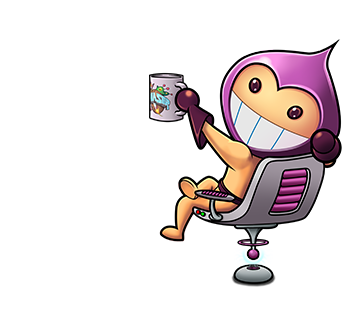

# 欢迎

你好！这是Dude：

<figure><figcaption>
Phaser js Dude
</figcaption></figure>

Dude 来自[ Phaser](https://phaser.io/)，Phaser 是一个用 Javascript 写游戏的工具。不过这个教程的目的并不是教大家如何学习使用 Javascript 写游戏，而是在 Phaser 环境下学习理解 Javascript 里重要概念。和 Dude 一起学 Javascript，不枯燥。

**几点想法：**

1. **理解比记忆更重要：**&#x5BF9;概念的理解比记住什么语法更重要，尤其在今天 AI 辅助编程的时代，记忆是在不断地练习过程中自然而然发生的事物。与其花时间去记什么语法，不如用同样的时间去多练习。每学一课，不要问自己我记住了什么，要问自己我理解了什么。
2. **了解为什么：**&#x9A6C;斯克说，教学时灌输知识，不如让学生理解为什么有这些知识，它们与现实世界如何关联。由此，我每讲一个概念时，一定会重点讲讲这个概念目的是要解决什么样的问题。
3. **项目驱动：**&#x8981;想写好 Javascript，当然是要练习练习再练习。不过不要为练而练，要有个项目去做，在做中练。因此我想从一开始就在实际工作所需要的软件中写代码，每一行代码都是一个项目的一部分，而不是在为了学习而做出的假的环境中写一些演示类代码。
4. **成就感：**&#x9879;目和工程导向非常重要。在做项目的过程中，你需要克服各种困难，最终完成一个可以用的产品，然后再经过用户反馈、修 bug ，调整，使产品更完美。产品做出来了，你就会有成就感，我们需要这种成就感让我们坚持做下去。

### 一起来吧！
